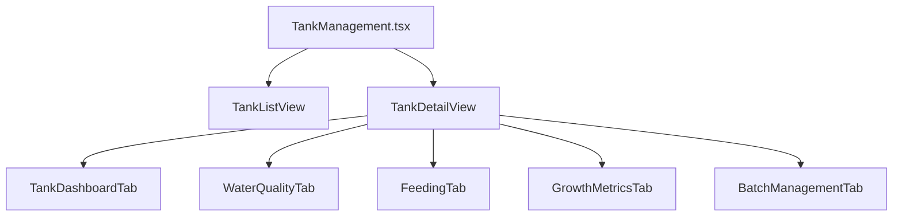
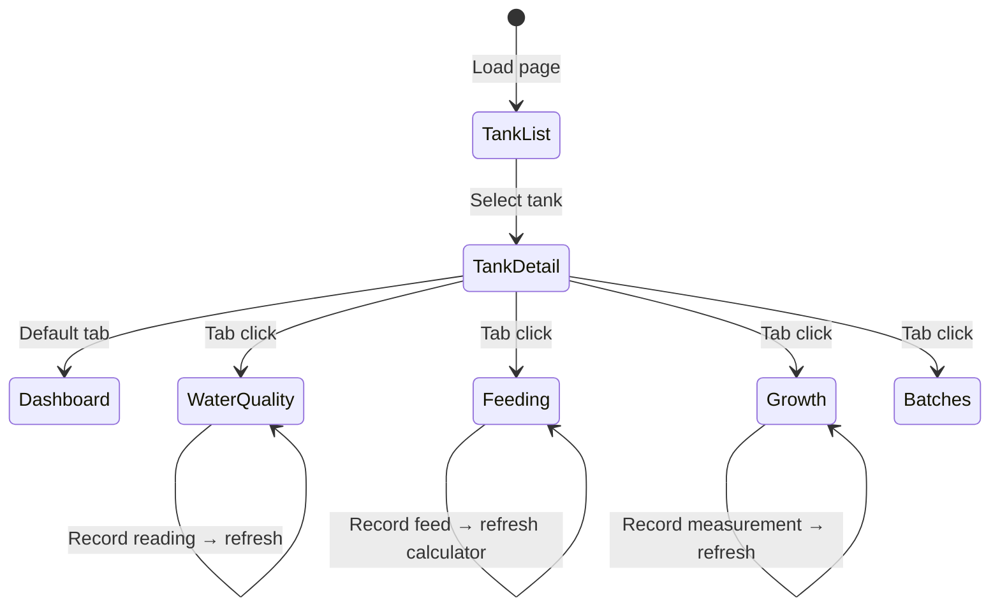

# Frontend Implementation Plan — Tank Management Module

> Component: `src/components/TankManagement.tsx`
> Page ID: `tanks`
> API Base: `/api/v1/tanks`

---

## Architecture Overview

---

## Task 1: Tank List View

**API:** `GET /api/v1/tanks` → `TankSummaryResponseDto[]`

### Sub-tasks

- [ ] **1.1** Create `TankListView` component — grid of tank summary cards
- [ ] **1.2** Tank Summary Card — shows name, status badge, fish type, biomass bar, WQ status indicator, feeding progress bar
- [ ] **1.3** Status filter bar — filter by `TankStatus` (ACTIVE, INACTIVE, MAINTENANCE, EMPTY)
- [ ] **1.4** "New Tank" button + `CreateTankModal` form (`name`, `location`, `volumeCubicMeters`, `status`)
  - **API:** `POST /api/v1/tanks` → [CreateTankDTO](file:///d:/projects/fishFarmSystem/src/modules/aquaculture-system/src/modules/tank/application/dtos/TankDto.ts#5-26)
- [ ] **1.5** Click card → navigate to Tank Detail View

---

## Task 2: Tank Dashboard Tab

**API:** `GET /api/v1/tanks/:id/dashboard` → [TankDashboardResponseDto](file:///d:/projects/fishFarmSystem/src/modules/aquaculture-system/src/modules/tank/application/dtos/TankDto.ts#93-101)

### Sub-tasks

- [ ] **2.1** Create `TankDashboardTab` — main tab displayed on tank selection
- [ ] **2.2** Tank Info Header — tank name, volume (m³), status badge
- [ ] **2.3** Summary KPIs strip — render `TankSummaryItemDto[]` as stat cards (`label`, `value`, `subValue`)
- [ ] **2.4** Capacity Gauge — circular/radial chart showing:
  - `currentLoadKg` / `capacityKg`
  - `percentageUsed`
  - `stockingDensity` (kg/m³)
  - Overstock warning indicator if `overstockPercentage > 0`
- [ ] **2.5** Water Quality Summary Panel — `overallStatus` badge with colored indicators for Temp, DO, pH, NH₃
- [ ] **2.6** Feeding Progress Panel — current meal / total meals, weight fed / target, progress bar with % label
- [ ] **2.7** Active Batches Table — `TankBatchSummaryItemDto[]`: batchId, status, count, avg weight, age

---

## Task 3: Water Quality Tab

### 3A — Water Quality Trend Charts

**API:** `GET /api/v1/tanks/:id/water-quality` → [TankWaterQualityResponseDto](file:///d:/projects/fishFarmSystem/src/modules/aquaculture-system/src/modules/tank/application/dtos/TankDto.ts#116-120)

- [ ] **3.1** Time-series line chart (Chart.js / Recharts) with 4 datasets:
  - Temperature (°C)
  - Dissolved Oxygen (mg/L) — horizontal danger line at 3, warning at 5
  - pH
  - Toxic Ammonia NH₃ (mg/L) — horizontal danger line at 0.05, critical at 0.1
- [ ] **3.2** Date range filter (7d / 30d / custom)
- [ ] **3.3** Water Quality History table — each reading row showing all parameters, status badge, [requiresAction](file:///d:/projects/fishFarmSystem/src/modules/aquaculture-system/src/modules/tank/domain/entities/WaterQuality.ts#135-142), `actionTaken`

### 3B — Record New Reading

**API:** `POST /api/v1/tanks/water-quality/:batchId` → [CreateWaterQualityReadingDTO](file:///d:/projects/fishFarmSystem/src/modules/aquaculture-system/src/modules/tank/application/dtos/WaterQualityDto.ts#5-61)

- [ ] **3.4** "New Reading" form/modal — fields:

  | Field | Type | Required |
  |---|---|---|
  | temperature | number | ✅ |
  | dissolvedOxygen | number | ✅ |
  | pH | number | ✅ |
  | totalAmmonia | number | ✅ |
  | nitrite | number | ✅ |
  | nitrate | number | ✅ |
  | salinity | number | optional |
  | alkalinity | number | optional |
  | co2 | number | optional |
  | measuredAt | date | optional |

- [ ] **3.5** Submit → auto-assessment (backend calculates `toxicAmmonia`, `overallStatus`, [requiresAction](file:///d:/projects/fishFarmSystem/src/modules/aquaculture-system/src/modules/tank/domain/entities/WaterQuality.ts#135-142), [allowsFeeding](file:///d:/projects/fishFarmSystem/src/modules/aquaculture-system/src/modules/tank/domain/entities/WaterQuality.ts#148-153))
- [ ] **3.6** Post-submit alert banner if `requiresAction = true` or `allowsFeeding = false`

### 3C — Reading Detail View

**API:** `GET /api/v1/tanks/water-quality/batch/:batchId` → `WaterQualityReadingResponseDTO[]`

- [ ] **3.7** Expand reading row → shows calculated fields: `toxicAmmonia`, `co2Content`, `doSaturationPercentage`, `ageInHours`
- [ ] **3.8** Action tracking — `actionTaken` toggle + `actionNotes` text area (uses [UpdateWaterQualityReadingDTO](file:///d:/projects/fishFarmSystem/src/modules/aquaculture-system/src/modules/tank/application/dtos/WaterQualityDto.ts#62-128))

---

## Task 4: Feeding Tab

### 4A — Feeding Calculator

**API:** `GET /api/v1/tanks/feeding-records/:tankId/calculate` → [TankFeedingCalculationResponseDto](file:///d:/projects/fishFarmSystem/src/modules/aquaculture-system/src/modules/tank/application/dtos/FeedingCalculationDto.ts#49-58)

- [ ] **4.1** Feeding Summary Header — total daily feed (kg), fed today, remaining, progress bar
- [ ] **4.2** Per-batch breakdown table — columns:

  | Column | Source |
  |---|---|
  | Batch ID | `batchId` |
  | Daily Feed (kg) | `totalDailyFeedKg` |
  | Per Meal (kg) | `feedPerMealKg` |
  | Meals/Day | `mealsPerDay` |
  | Fed Today | `fedTodayKg` |
  | Remaining | `remainingDailyFeedKg` |
  | Safety Status | Badge: OK 🟢 / WARNING 🟡 / STOPPED 🔴 |
  | Recommended Food | `recommendedFoodType.name` |

- [ ] **4.3** Safety Factors display — Tf, Df, Af gauges/badges with tooltips explaining each factor
- [ ] **4.4** Feeding rate info — `baseFeedingRate%` → `finalFeedingRate%` with factor breakdown

### 4B — Record Feeding

**API:** `POST /api/v1/tanks/feeding-records/:batchId` → `CreateFeedingRecordDto`

- [ ] **4.5** "Record Feeding" form — batch selector, weight (kg), food type, meal number, observations
- [ ] **4.6** After submit → refresh calculator to show updated `fedTodayKg` and `remainingDailyFeedKg`

### 4C — Feeding History & Schedule

**API:** `GET /api/v1/tanks/:id/feeding-history` → [TankFeedingHistoryResponseDto](file:///d:/projects/fishFarmSystem/src/modules/aquaculture-system/src/modules/tank/application/dtos/TankDto.ts#128-132)

- [ ] **4.7** Today's Schedule — meal cards showing `mealNumber`, `time`, `status`, `isCompleted`
- [ ] **4.8** History table — past feeding records with date, batch, weight, food type, compliance

---

## Task 5: Growth Metrics Tab

### 5A — Growth Analysis Dashboard

**API:** `GET /api/v1/tanks/:id/growth-metrics` → [TankGrowthMetricsResponseDto](file:///d:/projects/fishFarmSystem/src/modules/aquaculture-system/src/modules/tank/application/dtos/TankDto.ts#133-136)

- [ ] **5.1** Per-batch growth cards — current weight, SGR, ADG, FCR with [PerformanceRating](file:///d:/projects/fishFarmSystem/src/modules/aquaculture-system/src/modules/tank/domain/entities/GrowthMeasurment.ts#32-33) badges (EXCELLENT/GOOD/ACCEPTABLE/POOR)
- [ ] **5.2** Growth curve chart — weight over time (x: date, y: avg weight grams)
- [ ] **5.3** Performance KPIs — FCR trend, SGR trend, survival rate %

### 5B — Record Growth Measurement  

**API:** `POST /api/v1/tanks/growth/batch/:batchId` → [CreateGrowthMeasurementDto](file:///d:/projects/fishFarmSystem/src/modules/aquaculture-system/src/modules/tank/application/dtos/GrowthMeasurementDto.ts#6-71)

- [ ] **5.4** "New Measurement" form — fields:

  | Field | Type | Required |
  |---|---|---|
  | sampleSize | number | ✅ |
  | totalSampleWeightGrams | number | ✅ |
  | averageWeightGrams | number | ✅ |
  | minWeightGrams | number | ✅ |
  | maxWeightGrams | number | ✅ |
  | estimatedFishCount | number | ✅ |
  | daysInCulture | number | ✅ |
  | averageLengthCm | number | optional |
  | measuredBy | string | optional |
  | notes | string | optional |

- [ ] **5.5** Auto-calculate preview before submit — show estimated SGR, ADG, weight gain

### 5C — Measurement History

**API:** `GET /api/v1/tanks/growth/batch/:batchId` → `GrowthMeasurementResponseDto[]`

- [ ] **5.6** Table: date, avg weight, sample size, SGR, ADG, FCR, survival rate, uniformity (CV%), performance rating badge
- [ ] **5.7** Expand row → recommendations[], notes, measuredBy

---

## Task 6: Batch Management

**API:** `GET /api/v1/tanks/:id/batches` → [TankBatchesResponseDto](file:///d:/projects/fishFarmSystem/src/modules/aquaculture-system/src/modules/tank/application/dtos/TankDto.ts#102-106)

- [ ] **6.1** Batch summary stats bar (total fish, total biomass, avg FCR, avg SGR)
- [ ] **6.2** Batch detail cards — status, fish count, avg weight, age, stocking date
- [ ] **6.3** Batch feeding calculation — per-batch view using `GET /api/v1/tanks/feeding-records/batch/:batchId/calculate`

---

## Shared Components

- [ ] **S.1** `StatusBadge` — colored badge for `TankStatus`, [WaterQualityStatus](file:///d:/projects/fishFarmSystem/src/modules/aquaculture-system/src/modules/tank/domain/types/WaterQualityTypes.ts#1-2), [SafetyStatus](file:///d:/projects/fishFarmSystem/src/modules/aquaculture-system/src/modules/tank/domain/entities/FeedRecord.ts#23-24), [PerformanceRating](file:///d:/projects/fishFarmSystem/src/modules/aquaculture-system/src/modules/tank/domain/entities/GrowthMeasurment.ts#32-33)
- [ ] **S.2** `ProgressBar` — reusable for feeding progress, capacity, etc.
- [ ] **S.3** `MetricCard` — label + value + sub-value + trend indicator
- [ ] **S.4** `DateRangeFilter` — shared filter for trends/history views
- [ ] **S.5** API service layer (`tankApi.ts`) — typed functions for all 14 endpoints
- [ ] **S.6** **ID Display Rule**: For all entities displayed, always show both `name` and `id`.
- [ ] **S.7** **ID Formatting**: Truncate UUIDs to show only the first segment: `id.split('-')[0]`.

---

## State & Data Flow

---

## Priority Order

| Phase | Tasks | Dependencies |
|---|---|---|
| **Phase 1** | Task 1 (List) + Task 2 (Dashboard) + S.1-S.5 | None |
| **Phase 2** | Task 3 (Water Quality) | Phase 1 |
| **Phase 3** | Task 4 (Feeding) | Phase 1 |
| **Phase 4** | Task 5 (Growth) | Phase 1 |
| **Phase 5** | Task 6 (Batch Management) | Phase 1 |
